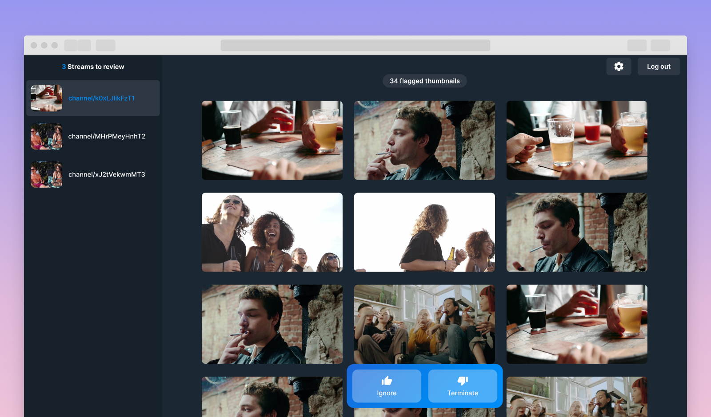
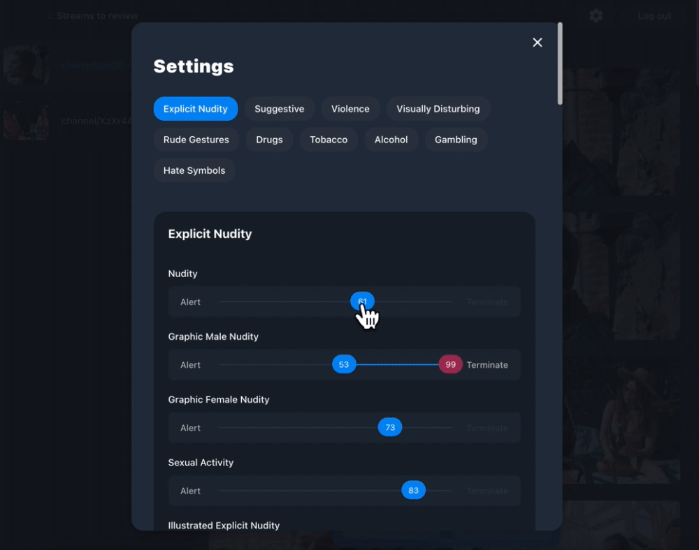

# Amazon IVS Moderation with Amazon Rekognition demo

This demo shows how you can use Amazon IVS's Auto-record to S3 feature in conjunction with Amazon Rekognition to build an automated moderation solution.

### This project is intended for education purposes only and not for production usage.

This is a serverless web application, leveraging [Amazon IVS](https://aws.amazon.com/ivs/), [Amazon Rekognition](https://aws.amazon.com/rekognition/), [Amazon API Gateway](https://aws.amazon.com/api-gateway/), [AWS Lambda](https://aws.amazon.com/lambda/), [Amazon DynamoDB](https://aws.amazon.com/dynamodb), [Amazon S3](https://aws.amazon.com/s3/). 
The web user interface is built using [React.js](https://reactjs.org/).

 

## Getting Started

⚠️ **IMPORTANT NOTE:** *Deploying this demo application in your AWS account will create and consume AWS resources, which will cost money.*

 
To get the demo running in your own AWS account, follow these instructions.

1. If you do not have an AWS account, please see [How do I create and activate a new Amazon Web Services account?](https://aws.amazon.com/premiumsupport/knowledge-center/create-and-activate-aws-account/)
2. Log into the [AWS console](https://console.aws.amazon.com/) if you are not already. Note: If you are logged in as an IAM user, ensure your account has permissions to create and manage the necessary resources and components for this application.

### Deploy and run the app

To deploy the serverless backend and run the client UI locally, complete the following steps:

1. Follow the steps in the [serverless app setup](./serverless) to deploy the backend to your AWS account.
2. Follow the steps in the [web-ui app setup](./web-ui) to run the client app locally.

 
------

This demo allows members of an admin group to configure parameters used when performing moderation checks. There are currently three controls available:
- **Confidence Test** - The confidence value set to Rekognition as part of the detection API call
- **Alert Threshold** - The confidence threshold above which an alert will be set but no proactive action taken
- **Terminated Threshold** - The confidence threshold above which the channel will by automatically stopped along with an accompanying notification.

Each of the thresholds represent a confidence value that if any of the checks breach will trigger the associated action. These settings are currently configured as environment variables associated with the Lambda function.

 

## About Amazon IVS
* Amazon Interactive Video Service (Amazon IVS) is a managed live streaming solution that is quick and easy to set up, and ideal for creating interactive video experiences. [Learn more](https://aws.amazon.com/ivs/).
* [Amazon IVS docs](https://docs.aws.amazon.com/ivs/)
* [User Guide](https://docs.aws.amazon.com/ivs/latest/userguide/)
* [API Reference](https://docs.aws.amazon.com/ivs/latest/APIReference/)
* [Learn more about Amazon IVS on IVS.rocks](https://ivs.rocks/)
* [View more demos like this](https://ivs.rocks/examples)
